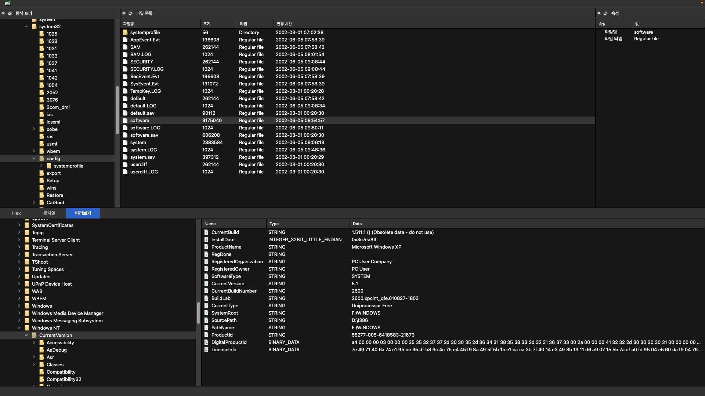

# QForensics

This tool is written in Python 3 with PySide6 and digital forensic libraries.

## Usage

### Development
```shell
git clone https://github.com/HyunP-dev/qforensics.git
cd qforensics
uv run qforensics
```

### Use only
```shell
uv tool install --from git+https://github.com/HyunP-dev/qforensics.git qforensics
qforensics
```

## Screenshots


